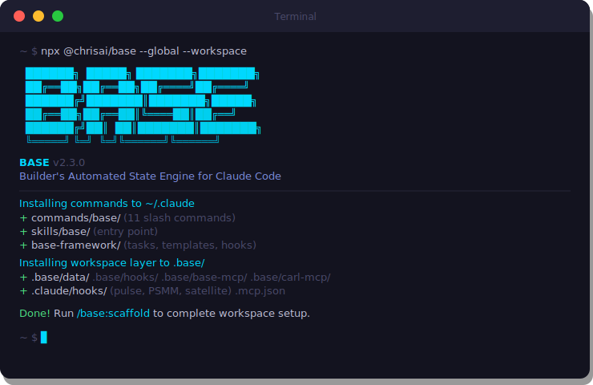

<div align="center">
  
</div>

<div align="center">

[](https://www.npmjs.com/package/@chrisai/base)
[](https://nodejs.org)
[](LICENSE)
[](https://claude.ai/code)

**Your AI builder operating system.**<br/>
Turn Claude Code from a per-session tool into a workspace that remembers, maintains itself, and never goes stale.

</div>

---

## The Problem Every Claude Code User Hits

You start a Claude Code session. Claude doesn't know:

- What you're working on
- What's blocked
- What you worked on yesterday
- What's overdue
- Which projects need attention

So you repeat yourself. Every. Single. Session.

Maybe you've tried fixing this with a massive `CLAUDE.md` file, `@`-mentions pointing at markdown docs, or manual context dumps at session start. It works... until it doesn't. Files go stale. Your CLAUDE.md becomes a junk drawer. You forget to update things. Claude starts making decisions based on outdated information. And the bigger your workspace gets, the worse it breaks.

**This is the duct tape phase.** Everyone goes through it. BASE is what comes after.

---

## What BASE Actually Does

BASE turns your Claude Code workspace into a managed operating system. Instead of scattered markdown files and manual context loading, you get:

**Structured data that Claude reads automatically.** Your active projects, backlog items, client lists — anything you want Claude to passively know about — lives in structured JSON files. Lightweight hooks inject compact summaries into every session automatically. You never type "here's what I'm working on" again.

**Health monitoring that catches drift before it hurts.** A drift score tracks how far your workspace state has drifted from reality. When things go stale, BASE tells you. When grooming is overdue, BASE tells you. You fix it with a guided maintenance cycle, not a weekend of cleanup.

**A manifest that drives everything.** One config file (`workspace.json`) declares what your workspace contains, how each area should be maintained, and what projects are in play. Every command reads from it. Your workspace is self-describing.

### What This Looks Like in Practice

You open Claude Code. Before you type anything, Claude already knows:

```xml
<active-awareness items="5">
[URGENT]
- [ACT-001] Client Portal Launch (Blocked: API auth)
  DUE: 2026-03-20
[HIGH]
- [ACT-002] Course Module 3 (In Progress)
- [ACT-003] MCP Server Refactor (In Review)

BEHAVIOR: PASSIVE AWARENESS ONLY.
Do NOT proactively mention unless user asks or deadline < 24h.
</active-awareness>
```

Claude doesn't nag. It doesn't start the session with "here are your tasks." But the moment you ask "what should I work on?" — the answer is instant and accurate. No file reading. No context window wasted. No stale data.

---

## How It Works

### Data Surfaces — The Core Concept

A "data surface" is just a structured JSON file paired with a hook that injects it into Claude's context. That's it.

```
JSON file (your data)  →  Hook (reads + summarizes)  →  Claude knows it
```

BASE ships with two built-in surfaces:

| Surface | What It Tracks |
|---------|---------------|
| **Active** | Current projects, tasks, blockers, deadlines, status |
| **Backlog** | Future work, ideas, deferred items with review deadlines |

But you can create surfaces for anything — clients, contacts, content pipelines, API keys, whatever persistent data you want Claude to passively know about. The `/base:surface create` command walks you through it: define a schema, pick an injection format, and BASE generates the JSON file, the hook, and the wiring automatically.

### The Manifest — One File Rules Everything

`workspace.json` is the brain. It registers:

- Every data surface and its schema
- Every tracked area in your workspace (projects, tools, content, clients...)
- Grooming schedules per area
- Audit strategies per area type
- Connected projects and their health status

Every BASE command reads from this manifest. You configure it once during setup, and the system maintains itself from there.

### Hooks — The Glue

BASE uses Claude Code's [hook system](https://docs.anthropic.com/en/docs/claude-code/hooks) to inject context automatically. There are two types:

**Every prompt** (`UserPromptSubmit`) — Fire on every message you send, keeping Claude's awareness current throughout the session:

| Hook | What It Does |
|------|-------------|
| **Pulse check** | Calculates workspace drift score, warns if grooming is overdue |
| **PSMM injector** | Re-injects important session moments (decisions, corrections, insights) into Claude's context so they don't get buried in a long session. [Details below.](#per-session-meta-memory-psmm) |
| **Surface hooks** | One per data surface (active, backlog, or custom). Reads the JSON, outputs a compact summary so Claude passively knows the current state |

**Session start** (`SessionStart`) — Runs once when a Claude Code session begins:

| Hook | What It Does |
|------|-------------|
| **PAUL project detection** | Scans your workspace for [PAUL](https://github.com/ChristopherKahler/paul) project files (`.paul/paul.json`) and auto-registers new ones into `workspace.json`. Only needs to run once — your project list doesn't change mid-session. (More on PAUL below.) |

All hooks are lightweight Python — they read JSON files and output compact XML summaries. No network calls, no heavy dependencies, no noticeable latency. A hook that has nothing to report outputs nothing and exits silently.

---

## Install

```bash
npx @chrisai/base --global --workspace
```

One command. Two layers:

- `--global` installs commands and the framework to `~/.claude` (shared across all your workspaces)
- `--workspace` installs the data layer to `.base/` in your current directory

Then open Claude Code and run `/base:scaffold` to configure your workspace with a guided setup.

```bash
# Full install — most users start here
npx @chrisai/base --global --workspace

# Already installed globally? Wire up a new workspace
npx @chrisai/base --workspace

# Global only — set up workspaces later with /base:scaffold
npx @chrisai/base --global
```

| Flag | What It Does |
|------|-------------|
| `--global` | Commands + framework to `~/.claude` (shared) |
| `--workspace` | Data layer to `.base/` in current directory |
| `--local` | Commands to `./.claude` instead of global |
| `--config-dir <path>` | Custom Claude config directory |
| `--workspace-dir <path>` | Target a specific workspace path |

---

## What Gets Installed

```
~/.claude/                              Shared across all workspaces
├── commands/base/                      11 slash commands
├── skills/base/                        Skill entry point + package sources
└── base-framework/
    ├── tasks/                          How each command works (pulse, groom, audit...)
    ├── templates/                      Schemas for workspace.json, STATE.md, surfaces
    ├── context/                        Core principles
    ├── frameworks/                     Audit strategies, project registration
    └── hooks/                          Session hook sources

.base/                                  Per-workspace
├── workspace.json                      The manifest — everything is registered here
├── data/
│   ├── active.json                     Active work surface
│   └── backlog.json                    Backlog surface
├── hooks/
│   ├── _template.py                    Hook template for creating new surfaces
│   ├── active-hook.py                  Injects active work into Claude's context
│   └── backlog-hook.py                 Injects backlog into Claude's context
├── base-mcp/                           MCP server for surface operations (CRUD)
└── carl-mcp/                           MCP server for rules engine operations

.claude/hooks/                          Registered in settings.json
├── base-pulse-check.py                 [UserPromptSubmit] Drift + groom reminders
├── psmm-injector.py                    [UserPromptSubmit] Session meta memory
└── satellite-detection.py              [SessionStart] PAUL project discovery
```

---

## The Maintenance Cycle

Most workspace management tools are set-and-forget. BASE is designed around the reality that workspaces are living things that drift.

### Pulse — Session Start Health Check

`/base:pulse` runs automatically via hook. It reads your manifest, checks filesystem timestamps, and calculates a drift score:

| Drift Score | What It Means | What to Do |
|-------------|--------------|------------|
| **0** | Everything is current | Work normally |
| **1-7** | Minor drift | Fix at next groom |
| **8-14** | Moderate — Claude may be acting on stale info | Groom soon |
| **15+** | Critical — workspace context is unreliable | Groom now |

No stop hooks. No unreliable session-end tracking. Pulse always starts from filesystem ground truth.

### Groom — Weekly Maintenance

`/base:groom` is a guided, voice-friendly walkthrough of your entire workspace. It reviews one area at a time, oldest-first:

1. **Active work** — "Still active? Status changed? Anything done?" — walks through each project and task
2. **Backlog** — Enforces time-based rules:
   - High priority items get 7 days before they demand a decision
   - Medium gets 14 days. Low gets 30 days.
   - Items that sit past 2x their review window get auto-archived.
   - "Decide or kill" — nothing sits in limbo forever.
3. **Graduation** — "Ready to work on any backlog items?" Items move to active work. Always explicit, never automatic.
4. **Directories** — Scans tracked directories (projects, clients, tools) for orphaned or new items
5. **Connected projects** — Checks project health across your workspace (more on this below)
6. **System layer** — Quick scan for dead hooks, unused commands, stale rules

Result: drift score resets to 0, summary gets logged, next groom date is set.

### Audit — Deep Optimization

`/base:audit` goes deeper than grooming. Each tracked area maps to a configurable audit strategy:

| Strategy | Applies To | What It Does |
|----------|-----------|-------------|
| `staleness` | Working memory files | Checks file age against thresholds |
| `classify` | Directories (projects/, clients/) | Lists items for triage: active, archive, or delete |
| `cross-reference` | Tools with config files | Finds orphaned tools and broken config references |
| `dead-code` | System directories | Finds unused hooks, commands, skills |
| `pipeline-status` | Content or task workflows | Flags stuck items and bottlenecks |

The number of audit phases is dynamic — generated from your manifest, not hardcoded. A small workspace gets 3 phases. A large one gets 12. Same command, adapted to your reality.

---

## MCP Servers — Claude Operates on Your Data

BASE ships two MCP servers so Claude can read and write your workspace data through structured tool calls instead of raw file edits.

### BASE MCP — Works With Any Surface

A generic CRUD interface for all registered surfaces. Claude can add items, update status, archive old work, and search across everything:

| Tool | What It Does |
|------|-------------|
| `base_list_surfaces` | List all surfaces with item counts |
| `base_get_surface` | Read all items from a surface |
| `base_get_item` | Get one item by ID |
| `base_add_item` | Add item (auto-generates ID, validates against schema) |
| `base_update_item` | Update specific fields (preserves everything else) |
| `base_archive_item` | Move item to archive with timestamp |
| `base_search` | Search across one or all surfaces by keyword |

When you create a new surface, the MCP server auto-discovers it from `workspace.json`. No code changes needed.

### CARL MCP — Rules Engine + Decision Memory + Session Intelligence

[CARL](https://github.com/ChristopherKahler/carl) (Context Augmentation & Reinforcement Layer) is a dynamic rules engine for Claude Code. On its own, CARL stores behavioral rules in domain files — groups of rules that load automatically based on what you're doing. Say "check Skool" and CARL loads your Skool community rules. Start coding and it loads your development standards. The rules are just config files in `.carl/`.

BASE ships CARL's MCP server, which gives Claude programmatic access to three powerful systems:

#### Dynamic Rules

Claude can read, search, and manage your rule domains through tool calls instead of file edits:

| Tool | What It Does |
|------|-------------|
| `carl_list_domains` | List all rule domains and their status |
| `carl_get_domain_rules` | Read rules for a specific domain |
| `carl_stage_proposal` | Stage a new rule proposal for review (more on this below) |

#### Decision Logger

Decisions get lost. You make a call in one session — "we're using OAuth, not API keys" — and three sessions later Claude asks you the same question. Or worse, it makes the opposite choice because it has no memory of what you decided.

CARL's decision logger fixes this. Decisions are stored per domain (e.g., `decisions/development.json`, `decisions/global.json`) and **load automatically alongside domain rules**. When CARL loads the "development" domain because you're coding, every decision you've ever logged in that domain loads with it as lightweight metadata. Claude reads your decisions before acting on the prompt itself. It never misses a key decision again — not because it searches for it, but because the decision is already in context the moment the domain is relevant.

| Tool | What It Does |
|------|-------------|
| `carl_log_decision` | Record a decision with domain, rationale, and recall keywords |
| `carl_search_decisions` | Search across all domains when you need to find something specific |

#### Per-Session Meta Memory (PSMM)

Here's the problem with long Claude Code sessions: Claude's context window is huge (up to 1M tokens), but important moments — a design decision you made at minute 5, a correction at minute 20, a key insight at minute 45 — get buried under thousands of lines of tool output and code. By the time you're deep into the session, Claude has technically "seen" these moments but they've drifted so far back in context that they stop influencing behavior.

PSMM fixes this. When something significant happens during a session — a decision, a correction, a context shift, a key insight — Claude logs it:

| Tool | What It Does |
|------|-------------|
| `carl_psmm_log` | Log a session meta-memory entry (type: DECISION, CORRECTION, SHIFT, INSIGHT, COMMITMENT) |

The PSMM hook re-injects these entries into Claude's context on every prompt. Important moments stay hot for the entire session, no matter how long it runs.

#### The Rule Staging Pipeline

This is where PSMM, decisions, and rules connect into a learning loop:

1. **During a session** — Claude notices a pattern worth codifying (a correction you gave, a decision that should become policy, an insight about how you work)
2. **Stage it** — `carl_stage_proposal` creates a draft rule in staging, not in your live rules
3. **Review during hygiene** — BASE's `/base:carl-hygiene` command walks you through staged proposals: approve, edit, or kill each one
4. **Approved rules go live** — They become part of your CARL domains, loaded automatically in future sessions

This means your AI assistant gets smarter over time — not by accumulating a massive prompt, but by distilling session learnings into clean, targeted rules. And because staging exists, nothing goes live without your review. The hygiene cycle (part of BASE's groom flow) prevents staged proposals from going stale — they get reviewed or they get killed.

---

## Multi-Project Workspaces — BASE + PAUL

Here's where BASE really separates from "just another CLAUDE.md helper."

Most Claude Code users work on one project at a time. But real workspaces have multiple projects — apps, client work, tools, content pipelines — each in their own directory, sometimes their own git repo. Without something managing the workspace level, you lose track. Projects stall silently. Work gets abandoned. Nobody notices until it's a problem.

### What Is PAUL?

[PAUL](https://github.com/ChristopherKahler/paul) is a project orchestration framework for Claude Code. It manages individual project builds through a structured **Plan → Apply → Unify** loop:

- **Plan** — Define what you're building, break it into phases, get alignment before writing code
- **Apply** — Execute the plan phase by phase with built-in progress tracking
- **Unify** — Reconcile what was planned vs what was built, close the loop, start the next milestone

Each PAUL project lives in its own directory with a `.paul/` config folder that tracks the project's state, milestones, and phase history. PAUL is excellent at managing a single project's lifecycle. But it doesn't know about your other projects, your backlog, or your workspace health.

### Where BASE Comes In

BASE is designed to work alongside PAUL as the workspace layer that ties everything together. Think of it as the difference between **project management** and **portfolio management:**

- **PAUL** manages each project: "What phase am I in? What's the plan? What's left to build?"
- **BASE** manages your workspace: "Which of my 6 projects needs attention? Which ones are stalling? What should I work on today?"

### How They Connect

BASE automatically detects and registers PAUL projects across your workspace:

- A hook scans for `.paul/paul.json` files every prompt — when it finds a new PAUL project, it registers it in `workspace.json` automatically
- Activity timestamps from each project flow into the workspace manifest so BASE always knows when each project was last touched
- During weekly groom, BASE checks each registered project's health:
  - **Stuck?** — Planning done but implementation stalled for 7+ days
  - **Abandoned?** — No activity for 14+ days with work still incomplete
  - **Drifting?** — Milestone marked complete but no new work started
- You can configure health checks per project — enable or disable them in the manifest

BASE never modifies your projects. It only reads and reports. Each project manages itself through PAUL. BASE manages the workspace those projects live in.

```json
{
  "satellites": {
    "my-saas-app": {
      "path": "apps/my-saas-app",
      "engine": "paul",
      "state": "apps/my-saas-app/.paul/STATE.md",
      "registered": "2026-03-15",
      "groom_check": true,
      "last_activity": "2026-03-17T14:30:00-05:00"
    }
  }
}
```

### Without PAUL

Don't use PAUL? BASE still works as a standalone workspace framework. You still get:

- Data surfaces for tracking any structured information
- Drift detection and grooming for all workspace areas
- Audit strategies for directories, tools, and system files
- The full MCP server for surface CRUD
- Custom surface creation for anything you need

The project detection hook simply has nothing to find. Everything else operates independently.

---

## Creating Custom Surfaces

The built-in `active` and `backlog` surfaces are starting points. The real power is creating surfaces for your specific needs.

### `/base:surface create`

A guided workflow that generates everything:

```
> /base:surface create

What does this surface track? → "Client projects and their current phase"

What fields does each item need?
  - name (string, required)
  - company (string, required)
  - phase (enum: discovery, proposal, active, maintenance)
  - monthly_value (number)
  - next_action (string)

How should this appear in Claude's context?
  - Group by: phase
  - Summary format: "[ID] name — company (phase)"
  - Behavior: passive (silent unless asked)

Generating...
  + .base/data/clients.json
  + .base/hooks/clients-hook.py
  + workspace.json updated
  + Hook registered in settings.json
```

Next session, Claude passively knows your client roster without you doing anything.

### `/base:surface convert`

Already have a markdown file with structured data? This command reads it, detects the structure, proposes a JSON schema, migrates the content, and generates everything. Your old `@CLIENTS.md` file becomes a proper data surface with full MCP support.

---

## The Ecosystem

BASE is one layer of a three-part system. Each tool is fully independent — use one, some, or all.

| Tool | What It Manages | Core Question It Answers |
|------|----------------|------------------------|
| **BASE** | Your workspace as a whole | "What am I working on? What's stale? What needs attention?" |
| **[CARL](https://github.com/ChristopherKahler/carl)** | Session-level behavioral rules | "What rules and context should Claude load for what I'm doing right now?" |
| **[PAUL](https://github.com/ChristopherKahler/paul)** | Individual project builds | "What's the plan? What phase am I in? What's left?" |

**How they connect:**
- PAUL projects auto-register with BASE for workspace-level visibility
- CARL's MCP server ships inside BASE for full rule management
- BASE groom checks CARL rule health if configured
- No circular dependencies — each system's state is independent

Think of it as layers:

```
┌─────────────────────────────────┐
│  PAUL   (per-project lifecycle) │  Plan → Apply → Unify
├─────────────────────────────────┤
│  CARL   (per-session rules)     │  Load rules based on intent
├─────────────────────────────────┤
│  BASE   (workspace layer)       │  Surfaces, health, grooming
└─────────────────────────────────┘
```

You don't need all three. BASE works alone. But together, they turn Claude Code into something that manages your entire workspace — not just the file you're looking at.

---

## Design Principles

1. **If it's not current, it's harmful.** Stale context feeds Claude bad information. Maintenance isn't optional — it's the whole point.
2. **Every file earns its place.** Can't explain why it's here in 5 seconds? It moves or dies.
3. **Archive over delete.** When in doubt, archive. You can always delete later. You can't un-delete.
4. **The workspace is the product.** Treat it like production code, not a scratch pad.
5. **One manifest drives everything.** `workspace.json` is the single source of truth. No manual bookkeeping.
6. **Tools register themselves.** Projects auto-register. Surfaces auto-discover. Zero human memory required.
7. **Passive by default.** Claude has awareness. Claude does not nag.

---

## Quick Start

```bash
# 1. Install globally + wire current workspace
npx @chrisai/base --global --workspace

# 2. Open Claude Code
claude

# 3. Run guided workspace setup
/base:scaffold

# 4. Check workspace health anytime
/base:pulse

# 5. Weekly maintenance
/base:groom

# 6. Create a custom surface for anything you want Claude to know about
/base:surface create
```

---

## Requirements

- **Node.js** >= 16.7.0
- **Python 3** (for hooks)
- **[Claude Code](https://claude.ai/code)**

---

## License

MIT — [Chris Kahler](https://github.com/ChristopherKahler)
